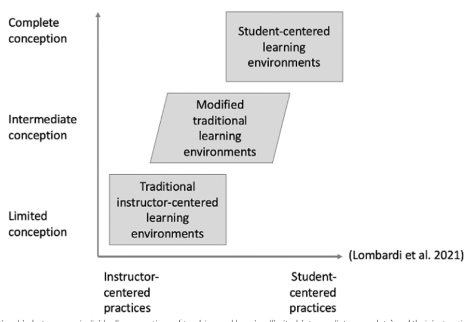

Imagine a teacher that teaches short workshops in higher education. Imagine that that teacher has the view that the learners are the sole responsible for their learning (i.e. the teacher has no responsibility to motivate the learners). Which papers investigate such a teacher's view? Is there a name for such a view on teaching? What causes such a view on teaching?

The closest name is a teacher-centered, transmission view; it treats learner autonomy as mainly the student’s job.
The papers split into three parts: which studies examine this view, what the view is usually called, and what seems to produce it.

Papers Investigating It

No paper here studies exactly the extreme claim that teachers have no responsibility to motivate learners, but several investigate closely related beliefs in higher education. 

- Borg, S., & Alshumaimeri, Y. (2017). Language learner autonomy in a tertiary context: Teachers’ beliefs and practices. Language Teaching Research, 23, 38 - 9. https://doi.org/10.1177/1362168817725759
- Lauermann, F., & Berger, J.-L. (2021). Linking teacher self-efficacy and responsibility with teachers’ self-reported and student-reported motivating styles and student engagement. Learning and Instruction, 101441. https://doi.org/10.1016/j.learninstruc.2020.101441
- Russell, J. M., Baik, C., Ryan, A., & Molloy, E. (2020). Fostering self-regulated learning in higher education: Making self-regulation visible. Active Learning in Higher Education, 23, 97 - 113. https://doi.org/10.1177/1469787420982378

The clearest direct match is work on learner autonomy beliefs, where teachers often define autonomy as students taking responsibility and control with little teacher involvement, and many explain weak autonomy mainly by student deficits such as low motivation or poor learning skills. 

- Borg, S., & Alshumaimeri, Y. (2017). Language learner autonomy in a tertiary context: Teachers’ beliefs and practices. Language Teaching Research, 23, 38 - 9. https://doi.org/10.1177/1362168817725759

Several higher-education studies examine teacher-centered or transmission conceptions in which the teacher’s role is to impart information and student sense-making is left largely to students. 

- Päuler-Kuppinger, L., & Jucks, R. (2017). Perspectives on teaching: Conceptions of teaching and epistemological beliefs of university academics and students in different domains. Active Learning in Higher Education, 18, 63 - 76. https://doi.org/10.1177/1469787417693507
- Rozhenkova, V., Snow, L., Sato, B. K., Lo, S. M., & Buswell, N. (2023). Limited or complete? Teaching and learning conceptions and instructional environments fostered by STEM teaching versus research faculty. International Journal of STEM Education, 10, 1-20. https://doi.org/10.1186/s40594-023-00440-9
- Kember, D. (1997). A reconceptualisation of the research into university academics' conceptions of teaching. Learning and Instruction, 7, 255-275. https://doi.org/10.1016/s0959-4752(96)00028-x
- Prosser, M., & Trigwell, K. (2014). Qualitative variation in approaches to university teaching and learning in large first-year classes. Higher Education, 67, 783-795. https://doi.org/10.1007/s10734-013-9690-0

The limited-to-complete continuum of teaching conceptions is summarized visually in a department-level figure showing how limited conceptions align with instructor-centered environments.

- Rozhenkova, V., Snow, L., Sato, B. K., Lo, S. M., & Buswell, N. (2023). Limited or complete? Teaching and learning conceptions and instructional environments fostered by STEM teaching versus research faculty. International Journal of STEM Education, 10, 1-20. https://doi.org/10.1186/s40594-023-00440-9
